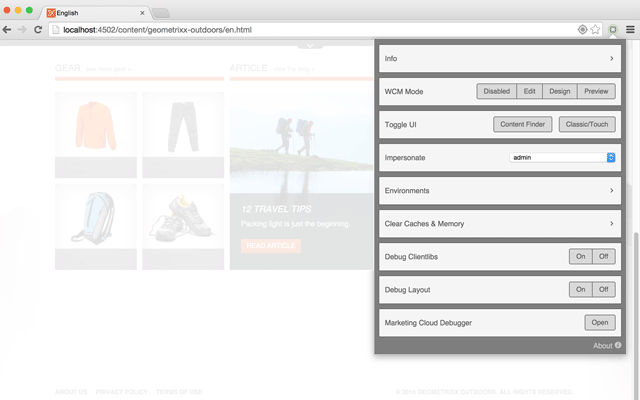
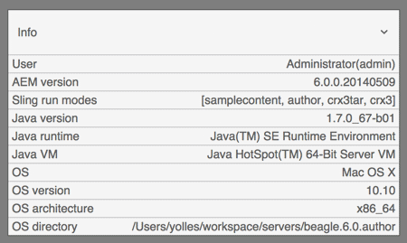
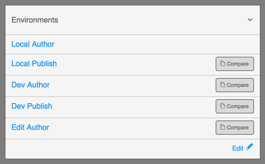
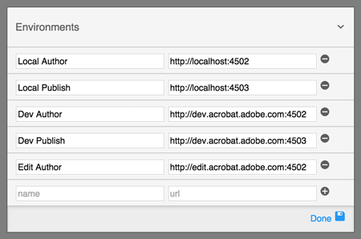
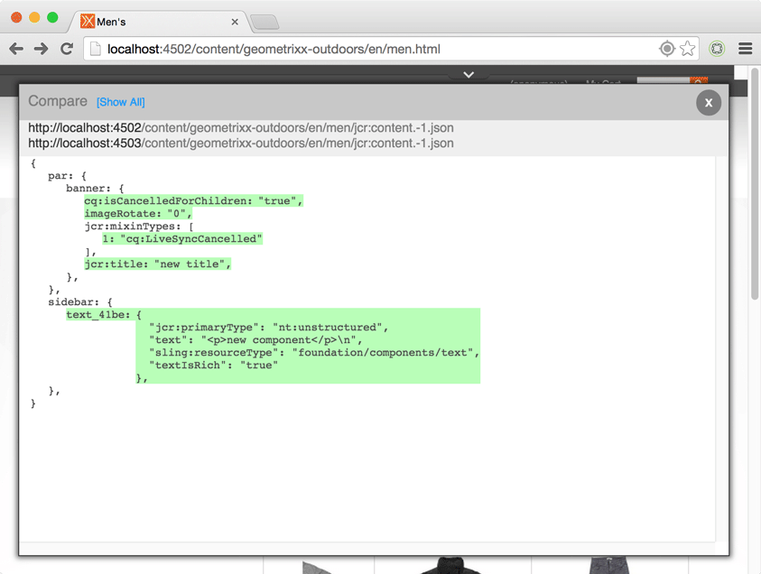
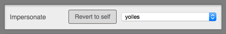
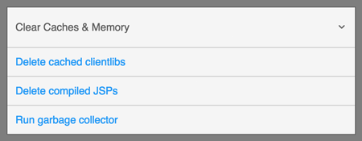
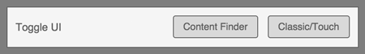

aem-developer-chrome
====================

Chrome extension for AEM developers.

A collection of tools and links to help the daily AEM developer work a little faster. It's a work in progress. Please feel free to provide feedback on my little side project.

General Info
------------

+ You can open links in the current Chrome tab simply by clicking on the links.
+ You can open the same links in a new Chrome tab by clicking on the 'external link' icon that appears to the right of the link.
+ A green response means that the operation was successful.
+ A red response means that the operation failed.
+ A yellow response means that the operation was successful but no action was needed (i.e. there were no compiled clients to delete)

Info
----

Provide information on the user, Sling, Java, and the OS. This is dependent on two logins, AEM and Felix, and the information will only show if you are logged in.

Environments
---------------

Open the current page in any of your predefined environments. Click 'edit' to add, remove, or update saved environments. Updates are immediately saved. '+' to add and '-' to remove entries. Click 'Done' to exit editing mode.

Click the icon next to the text to open the environment in a new browser tab.

Compare
---------------

Compare the current page to the same page in any environment. Toggle between showing only the difference or the entire node structure.

Impersonate
-----------

Impersonate users without having to go to the User Admin page. In addition, impersonating a user from this extension will simply reload the current page as that user. Click 'Revert to self' to end impersonation. If your current account doesn't have permission to impersonate, the dropdown will be empty.

Clear Cache and Memory
--------------------

Delete compiled clientlibs under the /var/clientlibs directory. Delete compiled JSP files under the /var/classes directory. Run the Garbage Collector without going to the Felix console.

Toggle UI
--------------------

Toggle Content Finder on and off. If you are in a Touch UI view, you will be taken to the classic view with Content Finder. Toggling between Classic and Touch UIs works in siteadmin/sites.html, publishingadmin/publications.html, damadmin/assets.html, welcome/projects.html, and normal view/editor.html. Unexpected redirects may happen if you are on a page that doesn't have a Touch/Classic equivalent.

Todo:
-----
+ Performance: extension starts too slow.
+ Remove jQuery from popup.js.
+ Chrome doesn't currently support HTML5 datalists in extensions, use when available.
+ Comparison should show reordering of nodes.
+ Comparison should have view as well.
+ Setup dev process: Grunt, Bower, SASS/LESS, build/zip/version, minification, concatenation, etc...
+ Improve UI Toggle for pages that don't map between Touch and Classic.
+ Test in AEM versions below 6.